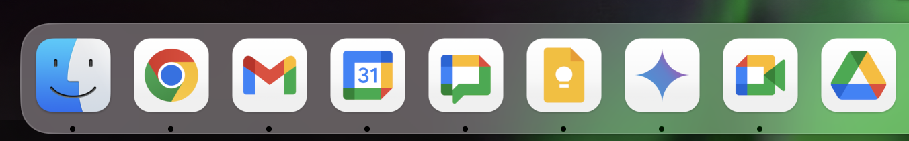

# Google Chrome App Icons for MacOS Dock

A small collection of Google Chrome app icons designed to personalize your MacOS Dock. These icons provide a sleek and stylish look for your Chrome apps, making your dock more visually appealing.

## Adding Chrome Apps to Your Dock

To add a Google Chrome app to your MacOS dock, follow these steps:

1. Open **Google Chrome** and navigate to the app you want to add.
2. Click on the **three-dot menu** in the top-right corner and select **More Tools** > **Create Shortcut**.
3. In the "Create Shortcut" dialog box, check the box labeled **Open as Window** (optional).
4. Click **Create**. The app will appear in your **Applications** folder.
5. Drag the newly created app from the **Applications** folder to your Dock.

Now, your Chrome app should be added to your Dock with its default icon.

## Changing Existing Icons

To change the icon of a Chrome app already in your Dock, follow these steps:

1. Download and choose a new icon from this repository.
2. Open the **Finder** and navigate to the app in the **Applications** folder.
3. Right-click on the app and select **Get Info**.
4. In the **Get Info** window, click on the app icon at the top-left corner to highlight it.
5. Drag and drop the new icon from the folder where you downloaded it onto the highlighted app icon in the **Get Info** window.
6. Close the **Get Info** window. The app icon in your Dock should now reflect the new icon.

## How to Contribute

If you have additional icons or suggestions, feel free to contribute to the project! Simply fork the repository, add your icons, and create a pull request.

## License

This project is licensed under the MIT License - see the [LICENSE](LICENSE) file for details.
